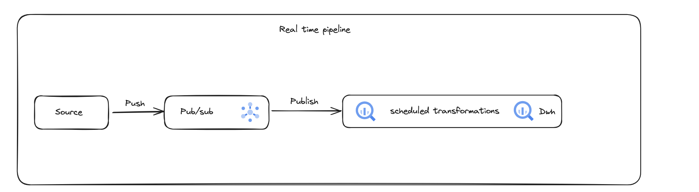
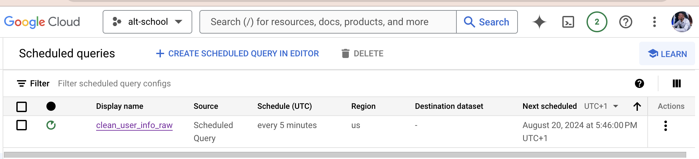
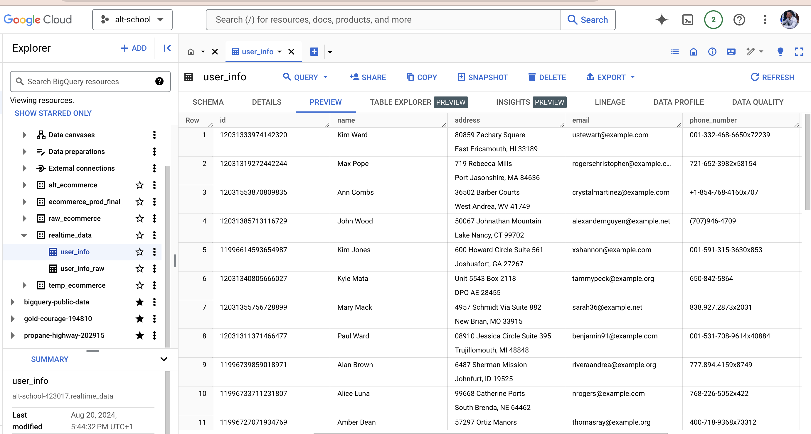

# Realtime data pipeline with Google Pub/sub


## Description
This project demonstrates how to utilize Google Pub/Sub to build a real-time data pipeline, while also employing scheduled queries in BigQuery to create a micro-batch system for data cleaning.

## Architecture


## Table of Contents
- [Installation](#installation)
- [Usage](#usage)
- [Features](#features)

## Installation

1. **Clone the repository:**
    

2. **Navigate to the project directory:**
   

3. **Install the dependencies:**
    ```bash
    pip install -r requirements.txt
    ```

4. **Set up environment variables:**
    Create a `.env` file in the root directory and add the necessary environment variables as per the `.env` file. follow the env-template file as a guide

5. **Create pub/sub artifacts:**
   Go to GCP create a subscriber and topic.

## Usage

1. **Run the Query:**
    ```
    python main.py
    ```

2. **create a schedueled the Query:**
    ```
    use the sql in clean_user_info_data to create a scheduled job that runs every 5 mins in bigquery that unnests the data from pubsub into different columns.
    ```
## Features
* requirements.txt
* main.py : query postgres db
* clean_user_info_data.sql : script to extract data from json column of published messages table and insert into final distination table.


## Scheduled Job


## Destination Table

