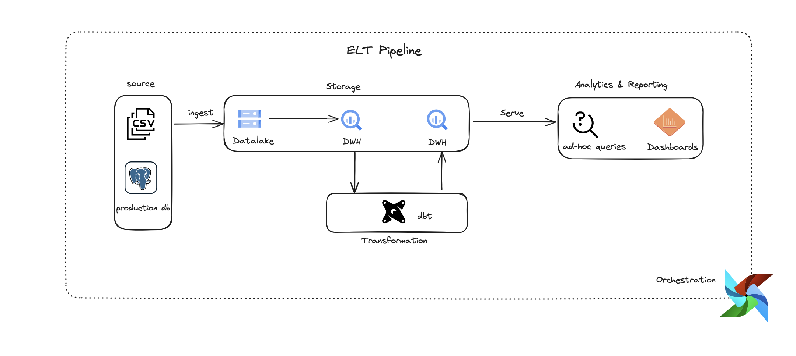
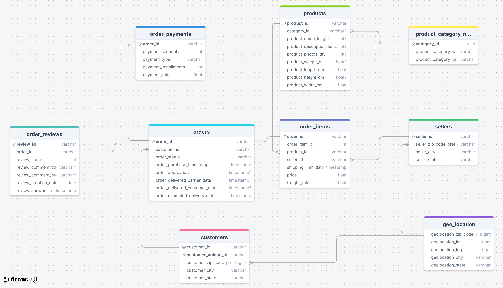
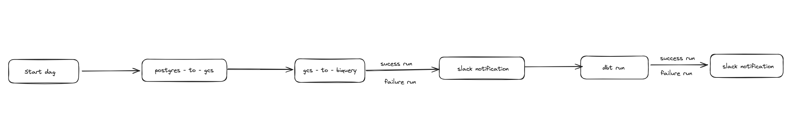
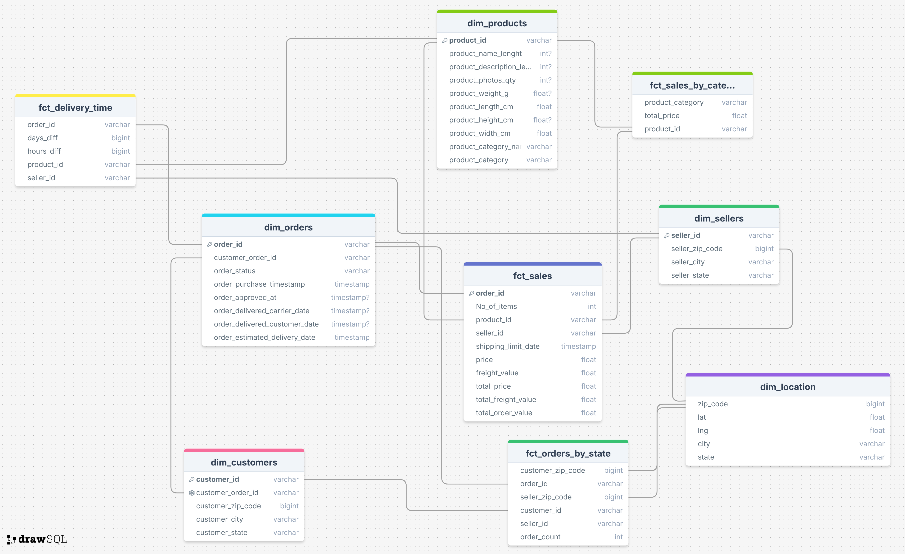
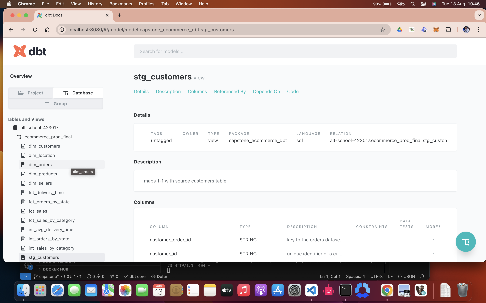

# Captstone Project : Data Engineering Lifecycle 

## Description
This project involves developing an end to end ETL(ELT) process using the olist ecommerce  dataset from Kaggle to help data end users answer some analytical questions. In this project i show a working knowledge of tools like, Postgresql, Docker/Docker Compose, Airflow, dbt and Bigquery.

## Data Architecture

## Table of Contents
#### [Data Ingestion into PostgreSQL](#data-ingestion-into-postgresql)
#### [Create GCS bucket and BigQuery Tables](#create-gcs-bucket-and-bigquery-tables)
#### [Setting up Airflow](#setting-up-airflow)
#### [Loading Data from PostgreSQL to BigQuery](#loading-data-from-postgresql-to-bigquery)
#### [Transforming and Modeling Data with dbt](#transforming-and-modeling-data-with-dbt)
#### [Answering Analytical Questions](#answering-analytical-questions)

# Data Ingestion into PostgreSQL
### ERD of Ecommerce database

#### Features
* data folder: contains Brazilian [Olist Brazilian E-Commerce Dataset](https://www.kaggle.com/datasets/olistbr/brazilian-ecommerce).
* Infra_setup folder : init.sql script with the DDL statements used create desired tables in postgres DB.
* docker-compose file : creates a postgres database called 'ecommerce' and ingest data into it using the init.sql script and csv data found in data folder.

# Create GCS bucket and BigQuery Tables
#### Features
* src folder : contains python scripts to create gcs bucket , datasets and bigquery tables.
* schemas folder: contains json files, the schemas of the tables to data will be loading into from postgres.

# Setting up Airflow
#### Features
* airflow folder : contains a docker compose file used to setup airflow. updated the docker compose file used to setup postgres, with the necessary services.

# Loading Data from PostgreSQL to BigQuery

#### Features
* dags folder : contains a python script. this is a pipeline that moves data from ecommerce postgres tables to bigquery tables

# Transforming and Modeling Data with dbt
### Dimensional Model overview

##### Features
* dbt folder : contains the dbt project. contains models to transform(clean data,rename columns, create metrics) and model the data in bigquery.
also contained in this folder is the data catalog and documentation of the tables created.

# Answering Analytical Questions
##### Features
* analytics folder: contains an sql file that contains sql queries that answer simple business questions like :
1. Which product categories have the highest sales?
2. What is the average delivery time for orders?
3. Which states have the highest number of orders?
